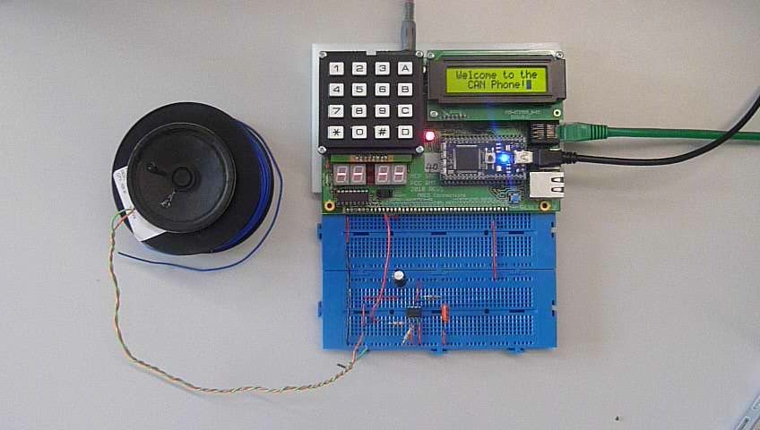
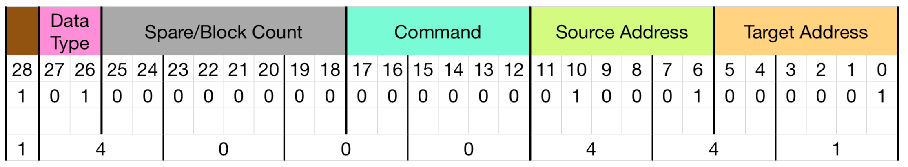

# CAN Phone

This repository contains the code that was developed as part of a university assignment to create a micro-controller based phone and messaging system, known as a 'station'. 

The stations had to be able to accomplish the following:
 - to send and receive text messages
 - to send and receive ringtones
 - to send and receive voice

The final system, shown below, included a menu system, the ability to send and receive text messages and ringtones, but not voice, an inbox to store messages and a morse code decoder.

The main entry point into the code can be found in the `serial.c` file. 



## Requirements Detail
To achieve the requirements, the stations needed to be able to send
and receive packets of data to and from the [Controller Area
Network (CAN) bus](https://en.wikipedia.org/wiki/CAN_bus). An example station, called the terminal,
provided the required functionality and was used as a test station. The exchange was another pre-existing station which supplied services to all other stations such as responding to certain commands.

The packets sent over the network consisted of a message ID, a length, type and format value and up to 8 data bytes split across two 4 byte arrays. The type indicated whether the message ID was a 29 bit word or an 11 bit word and here the former was used. The length was used to indicate how many bytes of data accompanied the packet, usually this was either 0 or 8. This message structure is shown below, and as below, the majority of the project involved coding in C. However, there were some hardware design elements involved in the project such as a speaker which was required to play ringtones and voice.

```c
typedef struct {
    uint32_t id;
    uint8_t  dataA[4];
    uint8_t  dataB[4];
    uint8_t  len;
    uint8_t  format;
    uint8_t  type;
} CAN_MSG_Type;
```

Ringtones were transmitted over the CAN bus as text strings using the [Ring Tones Text Transfer Language (RTTTL) format](http://merwin.bespin.org/t4a/specs/nokia_rtttl.txt), an example of which is shown below. These text strings were split into 3 main sections separated by colons. The first section gave the name of the ringtone, the middle section contained the default duration, octave and beats per minute (BPM) values and the final section contained the note data. In the example below, the default note duration is a crotchet, the default octave is the 5th and the ringtone is to be played at 63 beats per minute.

```
fifth:d=4,o=5,b=63:8P,8G5,8G5,8G5,2D#5
```

Voice, not achieved in this project, was transferred over the CAN bus with the use of the [Speex codec](http://www.speex.org) to compress and decompress the data.

Text messages were transferred in a similar way to ringtones; as data bytes attached to the CAN bus message packets. As each packet could hold a maximum of 8 bytes, it was highly likely that the data would have been spread over multiple packets, though there was a limit of 255 data packets for ringtone and text messages. The data type part of the message ID was used to differentiate between these message types.



The message ID not only held the data type, but also the station address the packet was to be sent to, the address of the station that sent the packet and the specific command that the packet was intended to do. The example above shows the 29 bit ID 0x14000441 which is a ‘Who Is Online?’ command from station 17 to station 1 (the exchange).